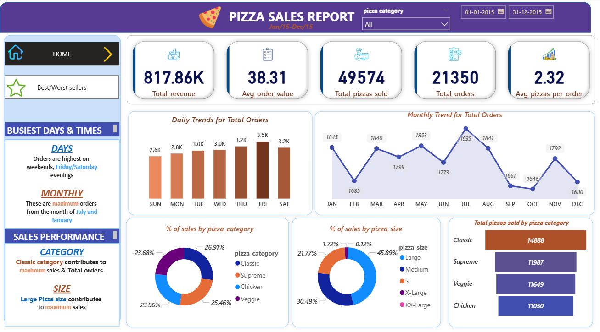
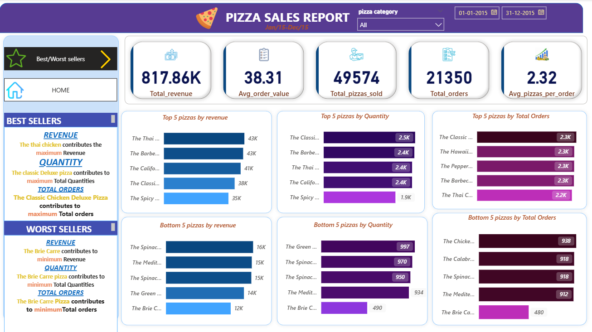

# 🍕 Pizza Sales Dashboard - MySQL + Power BI

## 📌 Project Overview
This project analyzes pizza sales data using **MySQL** for data processing and **Power BI** for interactive visualization.  
The goal is to identify sales trends, best-performing pizzas, and revenue drivers to enable data-driven decision-making.

## 🎯 Objectives
- Analyze monthly, daily, and hourly sales trends  
- Identify top-performing and low-performing pizza categories  
- Understand revenue contribution by pizza size and type  

## 🛠 Tools Used
- **MySQL**: Data cleaning, transformations, KPI calculations
- **Power BI**: Data modeling, DAX measures, interactive dashboards
- **Excel**: Initial data exploration

## 📊 Key Analyses
1. Sales KPIs (Revenue, Orders, Avg Order Value)
2. Daily & Monthly Sales Trends
3. Category & Size-wise Sales Distribution
4. Top & Bottom Performing Pizzas (Revenue, Orders, Quantity)

## 📂 Project Structure
- **SQL/**: All SQL scripts for data processing and KPIs
- **PowerBI/**: `.pbix` dashboard file
- **Images/**: Dashboard screenshots for quick view

## 📸 Dashboard Preview

## 🚀 How to Use
1. Open the `.pbix` file in Power BI Desktop  
2. Run SQL scripts on your MySQL database for calculations  
3. Refresh the dataset in Power BI to see the visuals

